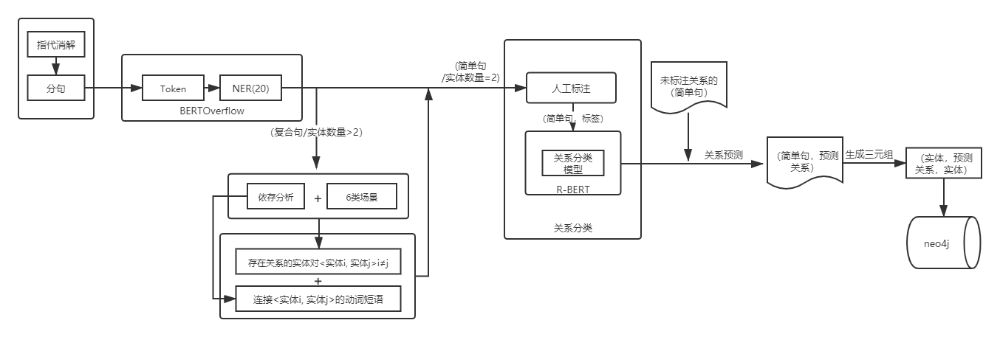
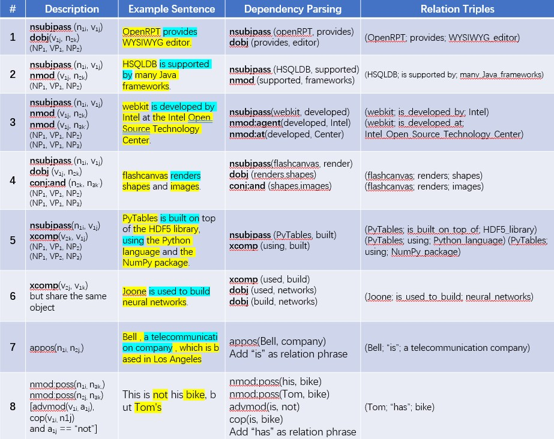

# HoIE-Hybrid Information Extraction
## Ⅰ、Architecture

## Ⅱ、Approach

Pipeline open information extraction (OIE) systems mainly have two sub-tasks (components): __named entity recognition (NER)__ and __relation extraction (RE)__. In pipeline OIE systems, NER task serves as input for all subsequent sub-tasks, which plays an important role. 

1. Implicit information extraction
   We exploit __dependency parsing (DP)__ to overcome issues that cannot recoginize implicit entities. In more detail, before NER phrase, HoIE exploits DP to get dependency information among constituents of each sentences. Then with these information and a set of domain-independent rules, HoIE could extract implicit information, for example, from __"This is not his bike, but Tom's"__ we can extract implicit triple `(Tom; has; bike)` and from __"Bell , a telecommunication company , which is based in Los Angeles"__ we can extract triples `(Bell; is; a telecommunication company)` and `(Bell; is based in; Los Angeles)` 

2. Compound sentence simplified (C2S)
   

4. 8 scenarios to extract relation triples
   

      
   

## Ⅲ、Dataset
1. CaRB：CaRB is a dataset cum evaluation framework for benchmarking Open Information Extraction systems, which has a size of 641 sentences.

2. CaRB-complex-45：CaRB45 is a dataset seleceted from CaRB, which has a size of 45 sentences. Each sentence has following features:
   - It is a compound sentence.
   - It includes at least two fact triples.
   - It doesn't involve reporting verbs like __said__, __told__, __asked__, etc.

3. BenchIE: BenchIE is a benchmark for measuring performance of Open Information Extraction (OIE) systems, which has a size of 300 sentences. In contrast to CaRB,BenchIE takes into account informational equivalence of extractions. Its gold standard consists of ___fact synsets___, clusters in which all surface forms of the same fact are listed.

4. OIE2016: TODO 

## Ⅳ、Evaluation

1. Performance of HoIE and various OIE systems on CaRB
   
   | System | precision | recall | F1-score |
   | :--- | :---: | :---: | :---: |
   | Ollie | 0.505 | 0.346 | 0.411 |
   | Props | 0.340 | 0.300 | 0.319 |
   | OpenIE4 | 0.553 | 0.437 | 0.488 |
   | OpenIE5 | 0.521 | 0.424 | 0.467 |
   | ClauseIE | 0.521 | 0.424| 0.450|
   | HoIE | __0.600__ | __0.457__ | __0.518__ |

2. Performance of HoIE and various OIE systems on BenchIE
   
   | System | precision | recall | F1-score |
   | :--- | :---: | :---: | :---: |
   | ClausIE | __0.50__ | 0.25 | 0.33 |
   | MinIE | 0.43 | __0.28__ | __0.34__ |
   | Stanford | 0.11 | 0.16 | 0.13 |
   | ROIE | 0.37 | 0.08 | 0.13 |
   | OpenIE6 | 0.31 | 0.21 | 0.25 |
   | MOIE | 0.39 | 0.16| 0.23 |
   | HoIE | 0.31 | 0.16 | 0.21 |

3. Comparison of various component-ablated versions of HoIE on __CaRB__
   <!--  -->
   

      
   

4. Comparison of various component-ablated versions of HoIE on __CaRB-complex-45__
   <!--  -->
   

      
   

   